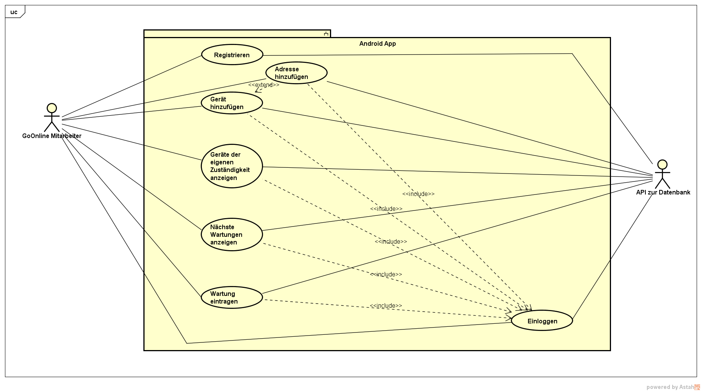

Work-in-progress

# Pflichtenheft

## Einsatz

### Zielgruppen
Mitarbeiter des Dienstleisters GoOnline

### Anwendungsbereiche
Verwendung von verschiedenen Standorten der Kunden von GoOnline aus

## Funktionen
"Anwendungsfälle der Android App in Verbindung mit der SQL Datenbank"

## Leistungen
Anforderungen an die Funktionen
- Ausführungszeit
- Genauigkeit
- Datentransfer-Volumen
- Datentransfer-Dauer

## Qualitätsanforderungen
**Qualitätsmerkmalen je eine Qualitätsstufe zuordnen**

### Funktionalität
|                       | sehr gut | gut | normal | nicht relevant |
|-----------------------|----------|-----|--------|----------------|
| **Funktionalität**    |          |     |        |                |
| Angemessenheit        |          |     | x      |                |
| Sicherheit            |          |     | x      |                |
| Interopabilität       |          |     |        | x              |
| Konformität           |          |     | x      |                |
| Ordnungsmäßigkeit     |          |     | x      |                |
| Richtigkeit           | x        |     |        |                |
| **Benutzbarkeit**     |          |     |        |                |
| Attraktivität         |          |     |        | x              |
| Bedienbarkeit         |          | x   |        |                |
| Erlernbarkeit         |          | x   |        |                |
| Konformität           |          |     |        | x              |
| Verständlichkeit      |          | x   |        |                |
| **Zuverlässigkeit**   |          |     |        |                |
| Fehlertoleranz        |          |     | x      |                |
| Konformität           |          |     |        | x              |
| Reife                 | x        |     |        |                |
| Wiederherstellbarkeit |          | x   |        |                |
| **Übertragbarkeit**   |          |     |        |                |
| Anpassbarkeit         |          |     |        | x              |
| Austauschbarkeit      |          |     |        | x              |
| Installierbarkeit     |          | x   |        |                |
| Koexistenz            |          |     |        | x              |
| Konformität           |          |     |        | x              |
| **Effizienz**         |          |     |        |                |
| Konformität           |          |     |        | x              |
| Zeitverhalten         |          | x   |        |                |
| Verbrauchsverhalten   |          |     | x      |                |
| **Wartbarkeit**       |          |     |        |                |
| Analysierbarkeit      |          |     | x      |                |
| Konformität           |          |     |        | x              |
| Modifizierbarkeit     |          |     | x      |                |
| Stabilität            | x        |     |        |                |
| Testbarkeit           |          | x   |        |                |

## Technisches Umfeld
In Reichweite des Netzwerkes einzurichten sind:

- SQL Server
- PHP Server
- Android Smartphone

## Gliederung
1. Android App: Anzeige und Modifikation der SQL-Daten
1. RESTful API: Zugriff auf die SQL-Datenbank
1. SQL Datenbank: Permanente Datenspeicherung

## Ergänzungen

## Tests

